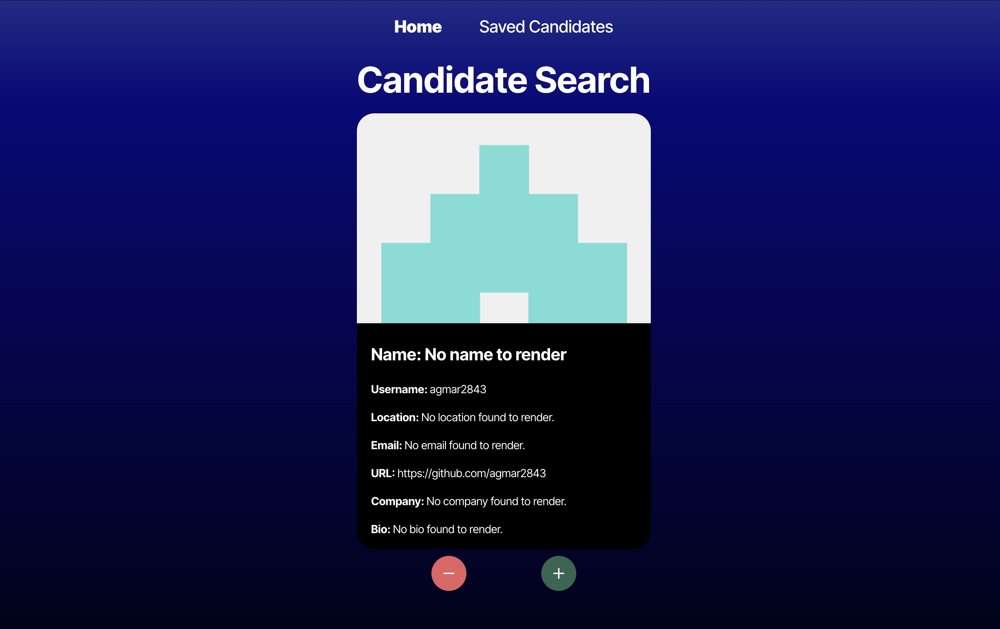

# Candidate Search

## Description
This is a client-side React application that utilizes the GitHub API to serve as a candidate search application. A GitHub user's profile information is rendered to the screen, and users are able to reject or save each profile that comes up. Users can navigate to a potential candidates page where any profiles they saved will be displayed together in a table, and the user may further reject any of the saved profiles. The application is deployed to Render and utilizes React and TypeScript.

## Table of Contents
1. [Installation](#installation)
2. [Usage](#usage)
3. [Contributing](#contributing)
4. [Tests](#tests)
5. [License](#license)
6. [Questions](#questions)

## Installation
To install the application locally, do the following in your terminal:

1. Clone the repository to your local computer.  
   `git clone git@github.com:lwebert/Challenge-13-CandidateSearch.git`
2. Check that node.js is installed.  
   `node -v`
3. Install dependencies.  
   `npm i`

## Usage
The application is deployed to Render, and can be found [here](https://challenge-13-candidatesearch.onrender.com/).

To run the application locally, open an instance of the application in your terminal. 
Run the following:
1. `npm run build`.
2. `npm run dev`. 
3. Open the application in your browser at http://localhost:5173/.

## Contributing
This application was developed by Lauren Webert. Here are some guidelines on ways to contribute:

Report a bug fix.

1. Create a new Issue in the GitHub repo.

Make local changes to push up.

1. Create a new branch (`git checkout -b <your-feature-branch-name>`)
2. Make your changes locally
3. Push the code back to the GitHub repo (`git push origin <your-feature-branch-name>`)
4. Create a pull request to merge your changes

## Tests
The application is working correctly if, when the application first loads, users are directed to the Candidate Search page and a GitHub user's profile appears on the screen. Users should be able to save and remove profiles to local storage and navigate between the Candidate Search and Saved Candidates pages without any errors.

## License
The application is covered under [Apache License 2.0](https://www.apache.org/licenses/LICENSE-2.0.txt).   
https://www.apache.org/licenses/LICENSE-2.0.txt

## Questions
- GitHub username: [lwebert](https://github.com/lwebert).
- Reach me at [lauren@weberts.org](lauren@weberts.org) with additional questions.
